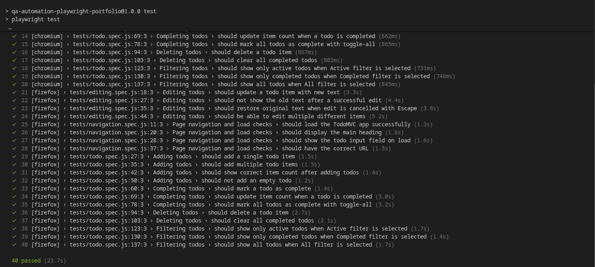

# QA Automation Portfolio — Playwright + JavaScript

[](https://github.com/Zarboni/qa-automation-playwright-portfolio/actions/workflows/playwright.yml)

A QA portfolio demonstrating both automated and manual testing skills. Built with [Playwright](https://playwright.dev/) and JavaScript, testing the [TodoMVC React app](https://demo.playwright.dev/todomvc) — a standard demo app that exercises common UI patterns.

Created by **Faiz Carstens** for QA Automation Engineer, Manual QA, and Application Support roles.

---

## Portfolio contents

| Artifact | Location | What it shows |
|---|---|---|
| Automated UI tests | `tests/` | Playwright automation across 3 test suites |
| Page Object Model | `pages/` | Maintainable, reusable locator and action management |
| Manual test cases | `docs/manual-test-cases.md` | Structured test case writing with steps and expected results |
| Bug reports | `docs/bug-reports.md` | Clear, actionable defect documentation with reproduction steps |
| CI/CD pipeline | `.github/workflows/playwright.yml` | Automated test runs on every push and pull request |

---

## Project structure

```
qa-automation-playwright-portfolio/
├── .github/
│   └── workflows/
│       └── playwright.yml             # GitHub Actions CI pipeline
├── docs/
│   ├── manual-test-cases.md           # 20 manually written test cases (TC-001 to TC-020)
│   └── bug-reports.md                 # 5 sample bug reports with full reproduction steps
├── pages/
│   ├── BasePage.js                    # Shared methods: navigation, title, page load
│   └── TodoPage.js                    # Page Object for all TodoMVC interactions
├── tests/
│   ├── todo.spec.js                   # Adding, completing, deleting, and filtering todos
│   ├── editing.spec.js                # Inline editing and edit cancellation
│   └── navigation.spec.js            # Page load, title, URL, and element visibility
├── playwright.config.js               # Playwright configuration (browsers, retries, reporting)
├── package.json
└── README.md
```

---

## Test Report Preview



## Getting started

### Prerequisites

- [Node.js](https://nodejs.org/) version 18 or higher

### 1. Clone the repository

```bash
git clone https://github.com/Zarboni/qa-automation-playwright-portfolio.git
cd qa-automation-playwright-portfolio
```

### 2. Install dependencies

```bash
npm install
```

### 3. Install Playwright browsers

```bash
npx playwright install
```

### 4. Run the tests

```bash
# Run all tests headlessly in Chromium and Firefox
npm test

# Run tests in headed mode (watch the browser)
npm run test:headed

# Open the interactive Playwright UI
npm run test:ui
```

### 5. View the HTML report

```bash
npm run test:report
```

---

## Test site

Tests run against **[TodoMVC (React)](https://demo.playwright.dev/todomvc)** — an official Playwright demo app. It is a simple to-do list application that exercises common UI patterns: forms, checkboxes, dynamic content, inline editing, and filtering.

---

## CI/CD

Every push and pull request automatically triggers the GitHub Actions workflow at `.github/workflows/playwright.yml`. It:

1. Installs Node.js and dependencies
2. Installs Chromium and Firefox browsers
3. Runs all tests across both browsers
4. Uploads the HTML report as a downloadable artifact

---

## Key concepts demonstrated

### Page Object Model (POM)

The POM pattern keeps test logic separate from UI interaction code. Selectors and actions are defined once in a Page Object class and called by name in tests. When the UI changes, only the Page Object needs updating — not every test.

**Without POM:**
```js
await page.getByPlaceholder('What needs to be done?').fill('Buy milk');
await page.getByPlaceholder('What needs to be done?').press('Enter');
```

**With POM:**
```js
await todoPage.addTodo('Buy milk');
```

### Test isolation

Each test starts fresh using `beforeEach`, so a failure in one test cannot affect others. This is a critical QA practice for reliable, repeatable results.

### Assertions

Playwright's `expect()` API is used throughout to verify outcomes:

```js
await expect(todoPage.todoItems).toHaveCount(3);
await expect(item).toHaveClass(/completed/);
await expect(page).toHaveURL(/.*todomvc/);
```

### Manual testing artefacts

The `docs/` folder contains examples of how I approach manual testing work:

- **Test cases** are written with clear preconditions, numbered steps, and specific expected results — the standard expected in a QA role.
- **Bug reports** follow a structured format with severity, environment, reproduction steps, and expected vs. actual behaviour — ready to be filed in Jira, Linear, or any bug tracker.

---

## Skills demonstrated

- Playwright test automation (JavaScript)
- Page Object Model design pattern
- Cross-browser test execution (Chromium, Firefox)
- CI/CD with GitHub Actions
- Test case writing (manual QA)
- Bug reporting and defect documentation
- Test organisation, grouping, and isolation
- HTML test report generation
